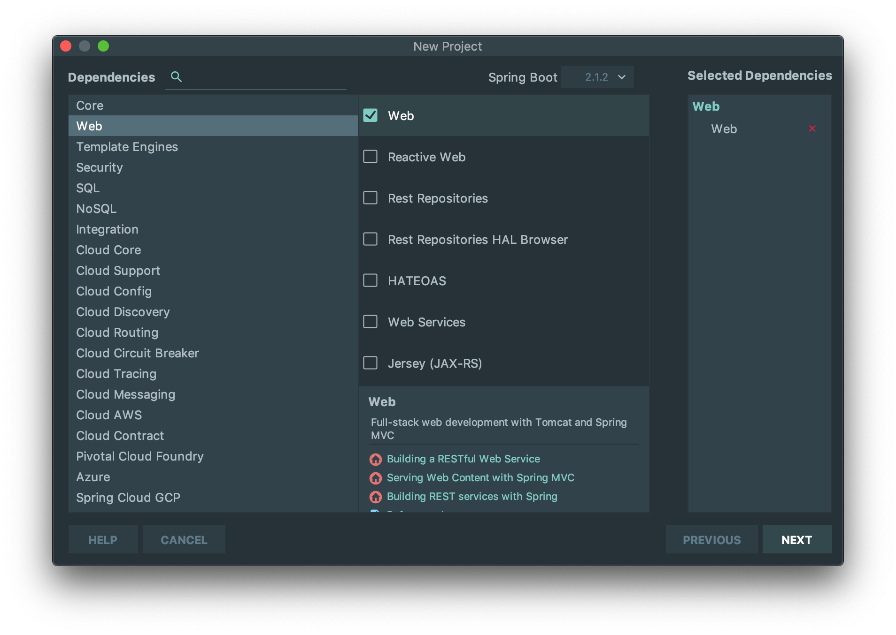

本指南将引导你用 Spring 构建一个 "Hello World" Restful Web 服务。

== 你将会构建

你将会构建一个能够接受 HTTP GET 请求的服务：

----
http://localhost:8080/greeting
----

并且将返回一个 JSON 响应

[source,json]
----
{"id":1,"content":"Hello, World!"}
----

你可以通过查询 URL 中一个可选的参数 `name` 来自定义 greeting 的内容：

----
http://localhost:8080/greeting?name=User
----

参数 `name` 将覆盖默认的值 "World"，反映到响应中就是：

[source,json]
----
{"id":1,"content":"Hello, User!"}
----

== 开始

创建一个 SpringBoot 的空项目。按照下图顺序

如果需要修改 Gradle 版本，可以修改：

`gradle/wrapper/gradle-wrapper.properties`
[source,java]
----
include::gradle/wrapper/gradle-wrapper.properties[]
----

在 https://services.gradle.org/distributions/ 可以查看所有 Gradle 的版本

现在你可以，点击 IDEA 的运行了。运行成功，可以访问 http://localhost:8080/

得到

因为你还什么都没有写。

== 第一个接口

首先写一个实体类

`./src/main/java/cc/capslock/spring/gsrestservice/Greeting.java`
[source,java]
----
include::./src/main/java/cc/capslock/spring/gsrestservice/Greeting.java[]
----

再写一个 Controller

`src/main/java/cc/capslock/spring/gsrestservice/GreetingController.java`
[source,java]
----
include::./src/main/java/cc/capslock/spring/gsrestservice/GreetingController.java[]
----

注解 `@RequestMapping` 保证了 HTTP 请求到 `/greeting` 被映射到 `greeting()` 方法。

NOTE: 上面的例子并没有明确说是 `GET`, `PUT`, `POST` 等，因为 `@RequestMapping` 默认映射所有的 HTTP 请求。如果想使用 GET，那么应该这样写 `@RequestMapping(method=GET)` 或者 `@GetMapping`。

`@RequestParam` 绑定了查询参数 `name` 和 greeting() 方法的参数 `name` 。如果 `name` 参数没有，默认是 "World" 。

运行一下吧

== 测试

运行一下吧。

访问 http://localhost:8080/greeting 

[source,json]
----
{"id":1,"content":"Hello, World!"}
----

和 http://localhost:8080/greeting?name=User

[source,json]
----
{"id":2,"content":"Hello, User!"}
----

成功！

== 自动化测试用例

`src/test/java/cc/capslock/spring/gsrestservice/GreetingControllerTest.java`
[source,java]
----
include::src/test/java/cc/capslock/spring/gsrestservice/GreetingControllerTest.java[]
----

== 总结

Congratulations! You've just developed a RESTful web service with Spring.

== 参考资料

https://spring.io/guides/gs/rest-service/
https://github.com/spring-guides/gs-rest-service

